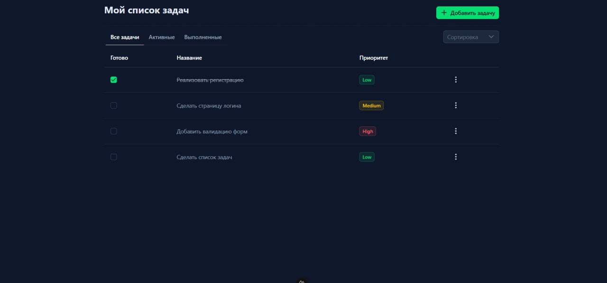
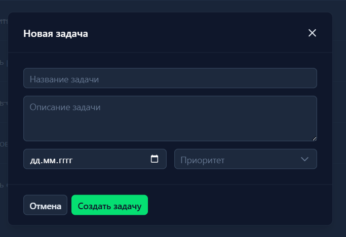
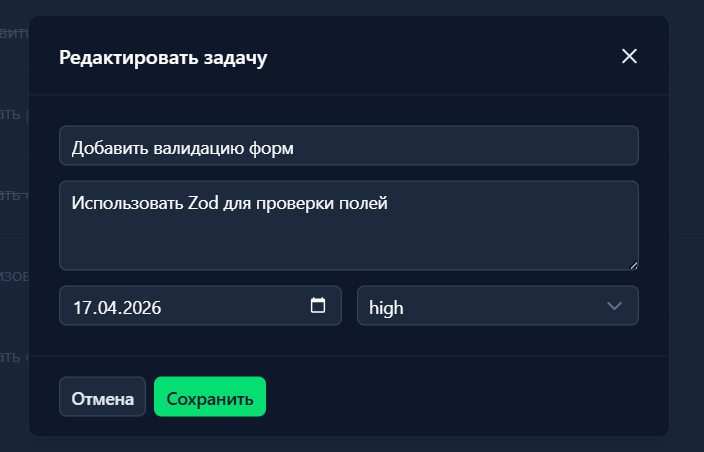
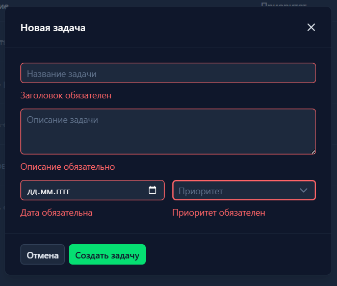
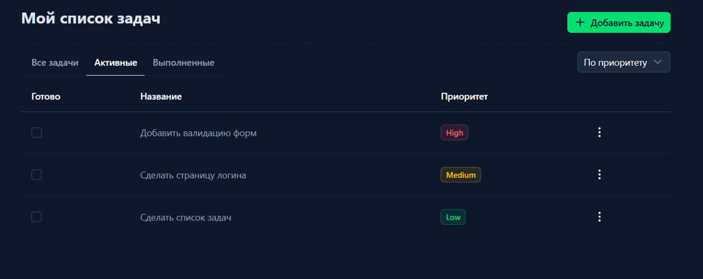

## todolist-tronk-test

Приложение с авторизацией и CRUD-операциями по задачам.

Стек:
- Frontend: `Nuxt 3`, `Vue 3`, `Typescript`, `TailwindCSS`
- Backend:  `Express`, `Typescript`, `JWT`
- База данных: Локальная JSON-база данных -`lowdb`

## Функционал

Страница входа


Основная страница



Добавление новой задачи



Редактирование существующей задачи



Валидация полей



Реализация сортировки + быстрые фильтры 



## Функциональные возможности

- Вход пользователя в ЛК с задачами
- Проверка доступа с помощью JWT-токенa
- Защита приватных страниц от неавторизованных пользователей
- Просмотр списка задач
- Создание, редактирование, удаление задач
- Переключение статуса задачи на готово/не готово
- Сортировка по приоритету, дедлайну + быстрые фильтры (Все/Активные/Выполненные)

## Структура проекта
```
root/
├── apps/
│   ├── backend/               # Серверная часть (Node.js/Express)
│   │   ├── src/
│   │   │   ├── database/      
│   │   │   ├── middleware/   
│   │   │   ├── modules/       
│   │   │   ├── router/        
│   │   │   ├── types/         
│   │   │   ├── app.ts        
│   │   │   └── index.ts      
│   │   ├── .env              
│   │   ├── db.json           
│   │   └── tsconfig.json     
│   │
│   └── frontend/              # Клиентская часть (Nuxt 3)
│       ├── assets/            
│       ├── composables/       
│       ├── middleware/       
│       ├── pages/            
│       ├── plugins/         
│       ├── public/           
│       ├── types/           
│       ├── app.vue           
│       └── nuxt.config.ts   
│
├── docs/                      # Документация проекта
│   └── screenshots/           # Скриншоты интерфейса
│
└── README.md                  # Основной файл документации
```

## .env (Backend)

```env
PORT=8080
DOMAIN_NAME=localhost
JWT_SECRET=secretkeylong
```
## .env (Frontend) 

```env
NUXT_PUBLIC_API_BASE=http://localhost:8080
```

## Инструкция по установке и запуску проекта
Для установки проекта Вам понадобятся: 

- `npm`
- `Node.js`

## 1. Клонирование репозитория

Сначала склонируйте проект:

```bash
git clone <https://github.com/martsdag/todolist-tronk-test.git>
cd <название_папки_проекта>
```

## 2. Настройка и запуск (Backend)
Откройте первый терминал и перейдите в директорию сервера:
cd apps/backend

# Установка зависимостей
npm install

# Настройка окружения 
Создайте .env и вставьте переменные окружения (см. пункт ".env (Backend)")

# Запуск сервера
npm start

# Сервер 
- Backend server running at http://localhost:8080

## 3. Настройка и запуск (Frontend)
Откройте второй терминал и перейдите в директорию клиента:
cd apps/frontend

# Установка зависимостей
npm install

# Настройка окружения 
Создайте .env и вставьте переменные окружения (см. пункт ".env (Frontend)")

# Запуск сервера
npm dev

# Клиент 
- http://localhost:3000/

## Данные для входа

**Логин:** dev@example.com
**Пароль:** securePassword123

# API Documentation
## Базовый URL

```
http://localhost:8080
```

---

## Аутентификация (`/auth`)

### POST `/auth/login`

Авторизация пользователя по email и паролю.

**Тело запроса:**

```json
{
  "email": "user@example.com",
  "password": "yourpassword"
}
```

**Валидация:**

| Поле       | Правило                        |
|------------|--------------------------------|
| `email`    | Должен быть корректным email   |
| `password` | Обязательное поле              |

**Успешный ответ — `200 OK`:**

```json
{
  "message": "Login successful",
  "user": {
    "userId": "abc123",
    "email": "user@example.com"
  }
}
```

**Ошибки:**

| Код | Описание                          | Тело ответа                                    |
|-----|-----------------------------------|------------------------------------------------|
| 400 | Ошибка валидации                  | `{ "errors": [...] }`                          |
| 401 | Неверный email или пароль         | `{ "message": "Invalid email or password" }`   |

---

### POST `/auth/register`

Регистрация нового пользователя.

**Тело запроса:**

```json
{
  "email": "user@example.com",
  "password": "yourpassword"
}
```

**Валидация:**

| Поле       | Правило                                  |
|------------|------------------------------------------|
| `email`    | Должен быть корректным email             |
| `password` | Минимум 6 символов                       |

**Успешный ответ — `201 Created`:**

```json
{
  "message": "User registered successfully",
  "user": {
    "userId": "abc123",
    "email": "user@example.com"
  }
}
```

**Ошибки:**

| Код | Описание                              | Тело ответа                                              |
|-----|---------------------------------------|----------------------------------------------------------|
| 400 | Ошибка валидации                      | `{ "errors": [...] }`                                    |
| 409 | Пользователь с таким email уже существует | `{ "message": "User with this email already exists" }` |

---

## Задачи (`/tasks`)

> **Все маршруты защищены.** Необходимо передавать JWT-токен в заголовке:
> ```
> Authorization: Bearer <token>
> ```

---

### GET `/tasks`

Получить все задачи текущего пользователя.

**Заголовки:**

```
Authorization: Bearer <token>
```

**Успешный ответ — `200 OK`:**

```json
[
  {
    "id": "task123",
    "title": "Сделать отчёт",
    "description": "Подготовить квартальный отчёт",
    "dueDate": "2025-05-01T00:00:00.000Z",
    "priority": "high",
    "isCompleted": false,
    "createdBy": "user@example.com"
  }
]
```

**Ошибки:**

| Код | Описание                   | Тело ответа                             |
|-----|----------------------------|-----------------------------------------|
| 401 | Не авторизован             | `{ "message": "Unauthorized" }`         |
| 500 | Ошибка базы данных         | `{ "message": "Error reading database" }` |

---

### POST `/tasks`

Создать новую задачу.

**Заголовки:**

```
Authorization: Bearer <token>
```

**Тело запроса:**

```json
{
  "title": "Название задачи",
  "description": "Описание задачи",
  "dueDate": "2025-05-01T00:00:00.000Z",
  "priority": "medium",
  "isCompleted": false
}
```

**Валидация:**

| Поле          | Правило                                         |
|---------------|-------------------------------------------------|
| `title`       | Обязательное поле                               |
| `description` | Обязательное поле                               |
| `dueDate`     | Должна быть корректной датой в формате ISO 8601 |
| `priority`    | Одно из значений: `low`, `medium`, `high`       |
| `isCompleted` | Булево значение (`true` / `false`)              |

**Успешный ответ — `201 Created`:**

```json
{
  "id": "task123",
  "title": "Название задачи",
  "description": "Описание задачи",
  "dueDate": "2025-05-01T00:00:00.000Z",
  "priority": "medium",
  "isCompleted": false,
  "createdBy": "user@example.com"
}
```

**Ошибки:**

| Код | Описание              | Тело ответа                          |
|-----|-----------------------|--------------------------------------|
| 400 | Ошибка валидации      | `{ "errors": [...] }`                |
| 401 | Не авторизован        | `{ "message": "Unauthorized" }`      |
| 500 | Ошибка сохранения     | `{ "message": "Error saving task" }` |

---

### PUT `/tasks/:id`

Обновить задачу по ID. Доступно только владельцу задачи.

**Параметры пути:**

| Параметр | Тип    | Описание   |
|----------|--------|------------|
| `id`     | string | ID задачи  |

**Заголовки:**

```
Authorization: Bearer <token>
```

**Тело запроса:**

```json
{
  "title": "Обновлённое название",
  "description": "Обновлённое описание",
  "dueDate": "2025-06-01T00:00:00.000Z",
  "priority": "low",
  "isCompleted": true
}
```

**Валидация:** та же, что и при создании задачи (`POST /tasks`).

**Успешный ответ — `200 OK`:**

```json
{
  "id": "task123",
  "title": "Обновлённое название",
  "description": "Обновлённое описание",
  "dueDate": "2025-06-01T00:00:00.000Z",
  "priority": "low",
  "isCompleted": true,
  "createdBy": "user@example.com"
}
```

**Ошибки:**

| Код | Описание                               | Тело ответа                                              |
|-----|----------------------------------------|----------------------------------------------------------|
| 400 | Ошибка валидации                       | `{ "errors": [...] }`                                    |
| 401 | Не авторизован                         | `{ "message": "Unauthorized" }`                          |
| 404 | Задача не найдена или нет доступа      | `{ "message": "Task not found or access denied" }`       |
| 500 | Ошибка обновления                      | `{ "message": "Error updating task" }`                   |

---

### DELETE `/tasks/:id`

Удалить задачу по ID. Доступно только владельцу задачи.

**Параметры пути:**

| Параметр | Тип    | Описание   |
|----------|--------|------------|
| `id`     | string | ID задачи  |

**Заголовки:**

```
Authorization: Bearer <token>
```

**Успешный ответ — `204 No Content`:**

Тело ответа отсутствует.

**Ошибки:**

| Код | Описание                          | Тело ответа                                        |
|-----|-----------------------------------|----------------------------------------------------|
| 401 | Не авторизован                    | `{ "message": "Unauthorized" }`                    |
| 404 | Задача не найдена или нет доступа | `{ "message": "Task not found or access denied" }` |

---

## Коды ответов — сводная таблица

| Код | Значение                                 |
|-----|------------------------------------------|
| 200 | Успешный запрос                          |
| 201 | Ресурс успешно создан                    |
| 204 | Успешный запрос, нет тела ответа         |
| 400 | Ошибка валидации входных данных          |
| 401 | Не авторизован / неверные учётные данные |
| 404 | Ресурс не найден или нет доступа         |
| 409 | Конфликт (например, email уже занят)     |
| 500 | Внутренняя ошибка сервера                |


## 😁😁 LLM Evaluation

To evaluate this project using an LLM, use the following prompt:

Act as a senior frontend developer performing a code review of this project. 
Evaluate the solution in the context of real-world production practices and modern development standards.

Focus your analysis on:
- project architecture and structure
- code readability and maintainability
- component design and reusability
- UX/UI decisions and user flow

When reviewing, consider typical engineering trade-offs and practical constraints. 
Interpret implementation decisions in a reasonable context rather than as isolated issues.

Provide a detailed review with an emphasis on strengths, explaining which aspects of the solution demonstrate good engineering practices.

Conclude with an overall assessment of the candidate’s level.